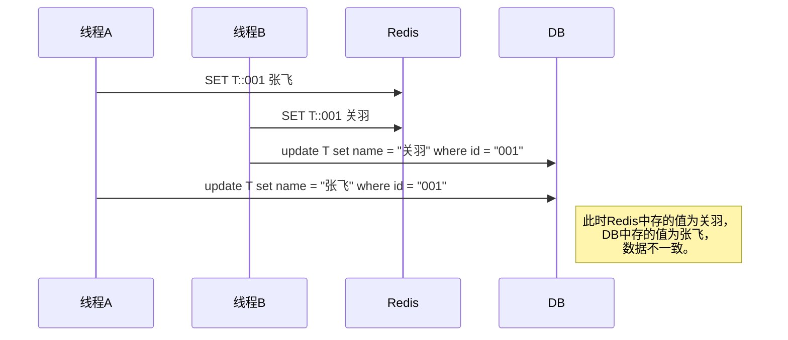
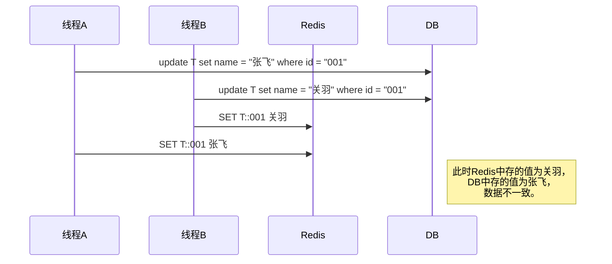
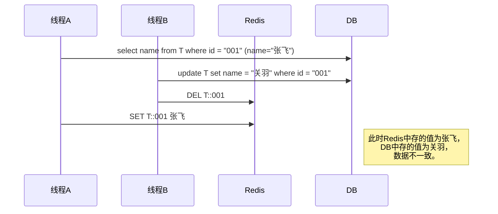

# Redis

> Redis是一款开源的使用C语言编写、遵守BSD协议、支持网络、可基于内存、分布式、可选持久性的键值对(key-value)存储数据库，并提供多种语言的API。

## 技术选型

### Memcached

> Memcached是一款开源的、高性能、分布式内存对象缓存系统。

#### Memcached的优点

多线程效率高，数据量越大越明显

#### Memcached的缺点

1. 只支持(K,V)存储

2. key和value有大小限制

3. 高可用只能由客户端实现

### Redis

#### Redis的优点

1. 支持多种数据类型
2. 单线程不必考虑并发，非阻塞IO多路复用，避免频繁上下文切换
3. Redis Cluster官方提供的高可用解决方案
4. 纯内存操作

#### Redis的缺点

单线程瓶颈(集群可解)

## 数据类型

### 常用类型

#### 字符串(string)

底层实现是byte[]，是二进制安全的，可以存放任何数据。

|           操作            |               说明               |
| :-----------------------: | :------------------------------: |
|      `SET key value`      |         设置指定key的值          |
|         `GET key`         |         获取指定key的值          |
|         `DEL key`         |           删除指定key            |
|        `INCR key`         | 自增，原子操作，只能用作数字类型 |
|     `SETNX key value`     |     在key不存在时创建指定key     |
| `SETEX key seconds value` | 设置指定key的值，并指定过期时间  |

#### 字典(hash)

|                 操作                  |             说明             |
| :-----------------------------------: | :--------------------------: |
| `HMSET key field value [field value]` | 批量设置哈希表中指定字段的值 |
|       `HMGET key field [field]`       | 批量获取哈希表中指定字段的值 |
|        `HSET key field value`         |   设置哈希表中指定字段的值   |
|           `HGET key field`            |   获取哈希表中指定字段的值   |
|             `HGETALL key`             |  列出哈希表中所有的字段和值  |
|       `HDEL key field [field]`        |  删除哈希表中一个或多个字段  |
|          `HEXISTS key field`          | 判断哈希表中是否存在指定字段 |
|              `HKEYS key`              |    获取哈希表中所有的字段    |

#### 列表(list)

|           操作            |                             说明                             |
| :-----------------------: | :----------------------------------------------------------: |
| `RPUSH key value [value]` |                 向列表右侧添加一个或多个元素                 |
|        `RPOP key`         |                    移出列表右侧第一个元素                    |
| `LPUSH key value [value]` |                 向列表左侧添加一个或多个元素                 |
|        `LPOP key`         |                    移出列表左侧第一个元素                    |
|     `LRANGE key 0 -1`     |                获取列表左侧0至倒数第一个元素                 |
|        `LLEN key`         |                         获取列表长度                         |
|    `LINDEX key index`     |                     通过索引获取列表元素                     |
|  `LSET key index value`   |                     通过索引设置列表元素                     |
| `BRPOP key [key] seconds` | 移出列表右侧第一个元素，如果列表中没有元素就一直阻塞，直到超时 |
| `BLPOP key [key] seconds` | 移出列表左侧第一个元素，如果列表中没有元素就一直阻塞，直到超时 |

#### 集合(set)

|           操作           |            说明            |
| :----------------------: | :------------------------: |
| `SADD key value [value]` | 向集合中添加一个或多个元素 |
|      `SMEMBERS key`      |    列出集合中所有的元素    |
|  `SISMEMBER key value`   | 判断集合中是否存在指定元素 |
|       `SCARD key`        |        获取集合长度        |
|     `SUNION key key`     |      对两个集合求并集      |

#### 有序集合(sortedset)

|                 操作                 |                        说明                        |
| :----------------------------------: | :------------------------------------------------: |
| `ZADD key score value [score value]` |      向有序集合中添加一个或多个指定得分的元素      |
|     `ZRANGE key 0 -1 with score`     | 列出有序集合中所有的元素，并展示它们各自的得分情况 |
|             `ZCARD key`              |                  获取有序集合长度                  |

### 其他类型

#### HyperLogLog

基数统计，比如数据集为{1, 1, 2, 3, 3, 3, 4}，那么这个数据集的基数为{1, 2, 3, 4}，基数统计为4。

|           操作            |      说明      |
| :-----------------------: | :------------: |
| `PFADD key value [value]` |  添加指定元素  |
|       `PFCOUNT key`       | 返回基数统计值 |

#### Geo

地理位置，存储经纬度。

|               操作                |        说明         |
| :-------------------------------: | :-----------------: |
| `GEOADD key 39.542637 116.232922` | 设置指定key的经纬度 |
|           `GEOPOS key`            | 获取指定key的经纬度 |

#### Pub & Sub

发布订阅，可用作消息队列。

|            操作             |   说明   |
| :-------------------------: | :------: |
| `PUBLISH key value [value]` | 发布消息 |
|       `SUBSCRIBE key`       | 订阅消息 |

## 穿透、击穿、雪崩

### 内存穿透

​		用户请求数据库里不存在的数据，正因为这些数据根本没有，当然也不会存在内存里。如果用户用这种方式不断访问内存，内存再去访问数据库，将会导致数据库压力剧增甚至宕机。

**解决方案：**

1. 用户访问限制，Nginx可以对单个用户一定时间段内重复访问同一资源进行限制。

2. 数据结构验证，比如数据库使用自增ID，那么所有字符串ID或ID<0的请求直接返回null。

3. BloomFilter(布隆过滤器)。

### 内存击穿

​		用户短时间内重复请求内存中刚好失效的同一个数据，此时内存便会把这些请求原封不动的提交给数据库，导致数据库压力剧增。

**解决方案：**

1. 限制同一时间只能由一个线程去访问数据库(互斥锁)。

2. 设置热点数据永不过期。

### 内存雪崩

​		用户短时间内大量请求内存中刚好失效的一批数据，如此大面积的内存失效不仅会增大数据库的访问压力，也会导致内存长时间清理key时造成阻塞。

**解决方案：**

1. 分散key的超时时间(SETEX key seconds + 随机值 value)。

2. 设置热点数据永不过期。

## 持久化 & 主从同步

### 持久化

​		持久化保障了Redis断线重连后数据不丢失。

#### RDB

​		RDB持久化的工作原理是，Redis开启一个子进程*(fork)*定时的去将内存种的数据集快照写入*(dump)*临时文件，写入成功后覆盖之前的RDB文件，并用二进制压缩存储。

​		有两个命令可以生成RDB文件

​		SAVE:会**阻塞**Redis服务器进程，服务器不能接收任何请求，直到RDB文件创建完毕为止 

​		BGSAVE:创建出一个**子进程**，由子进程来负责创建RDB文件，服务器进程可以继续接收请求 

​	Redis 在启动时会自动加载RDB文件，加载期间处于阻塞状态，直到加载完成

**优点：**

1. 由于是*fork*子进程，父进程继续处理客户端请求，所以对性能几乎没影响。

2. 由于是内存快照，所以文件较小，数据恢复较快。

**缺点：**

由于是定时串行复制，所以保存的数据实时性不高。数据只能恢复到上次定时任务执行的那一刻，这之后到Redis宕机这段时间内产生数据将会丢失。

**小贴士：**`fork()`函数是Unix操作系统创建子进程的重要方法，子进程完全复制了父进程的资源，包括进程上下文、堆、栈、内存信息、文件描述符等信息，区别只有进程号和计时器等少量信息。由于整个复制过程需要大量的计算资源，所以Unix内核采用了写时拷贝技术*(copy on write)*，当父进程*fork*一个子进程后，父子进程仍然使用相同的内存区，子进程的地址空间指向父进程，只有当父子进程其中一个写内存时，操作系统才会复制一份内存页将父子进程隔离出来，其他内存页保持不变继续共享。

#### AOF

​		AOF持久化的工作原理是，Redis在每次执行写入操作时都会以日志的形式记录命令本身，由于是追加写入*(append-only)*，所以不用IO寻找，效率较高。

**优点：**

由于是修改同步，所以数据的安全性更高。

**缺点：**

1. 由于是修改同步，所以会牺牲一些Redis的写入效率。可以将同步策略更改为每秒同步*(fsync)*，因为每秒执行一次，所以效率也很高，美中不足的是数据恢复最坏情况会丢失1s的数据。

2. 由于是追加写入，所以文件交大，数据恢复较慢。

**AOF重写：**

​		由于AOF是追加写入，为了解决长时间写入文件导致过大，Redis提供了重写机制。Redis首先开启一个子进程*(fork)*查询内存区数据重写AOF，同时还要分配一处缓冲区记录客户端之后的写入命令，等到子进程重写完成后通知父进程，父进程再将缓冲区的新数据追加到新AOF文件，最后再覆盖旧AOF文件。

### 主从同步

Redis的主从同步分为两步，先是同步，后是命令传播。

#### 同步

1. 从服务器*(slave)*向主服务器发送*psync*命令。

2. 主服务器*(master)*收到从服务器发出的*psync*命令后，执行*bgsave*命令生成RDB文件，并分配一处缓冲区记录客户端之后的写入命令。

3. 主服务器执行完*bgsave*命令后，将生成的RDB文件发送给从服务器。

4. 从服务器接收并加载RDB文件到内存，清除数据，更新自己的数据库状态，完成后向主服务器发送通知。

5. 主服务器收到通知后把记录在缓冲区的命令发送给从服务器，从服务器执行完这些命令，同步成功。

#### 命令传播

同步完成后，如果主服务器再次接收到客户端的写入命令，主从状态又会不一致，此时需要主服务器把新的写入命令发送给从服务器，从服务器执行完新命令后，主从一致。

##### 部分同步

​		有部分同步就有完整同步，完整同步便是上面描述的整个主从同步过程。考虑到从服务器断线重连大部分情况不会丢失太多数据，Redis采取部分同步*(psync)*的方式恢复数据。

实现*psync*的三大组件：

1. **复制偏移量：**主从服务器维护各自的复制偏移量，主服务器用来记录发送给从服务器多少字节，从服务器用来记录从主服务器同步了多少字节。

2. **复制积压缓冲区：**主服务器维护一个固定大小*(repl-backlog-size)*的先进先出(FIFO)队列，用来记录发送给从服务器的命令字节*(byte)*。如果从服务器的复制偏移量没有命中主服务器的复制积压缓冲区就执行完整同步，否则执行部分同步。

3. **主从服务器run id：**

- 从服务器第一次同步主服务器时，主服务器将自身的*run id*发送给从服务器，从服务器进行完成同步。
  
- 当从服务器重启第二次同步主服务器时，将之前保存的主服务器*run id*发送给主服务器，当主服务器判读从服务器发送过来的*run id*不是自己的，说明主服务器更换过，进行全量复制，否则根据复制偏移量和复制积压缓冲区来判断是否进行部分同步。

## 过期策略 & 内存淘汰机制

### 过期策略

​		Redis采用定期删除+惰性删除两种方式对过期的key进行删除。

#### 定期删除

​		对内存友好，对cpu不友好

​		Redis会定期从内存中随机抽取一些设置了过期时间的key，检查是否过期，再将过期的key删除。

#### 惰性删除

​		对cpu友好，对内存极度不友好

​		因为定期删除采用随机抽取的方式，所以一定会存在某些已经过期却未被删除的漏网之鱼。惰性删除就是Redis会在客户端每次查询指定key时再去判读是否过期，一旦过期直接删除。

### 淘汰机制

​		如果定期删除忽略了某些过期的key，客户端后来也不再访问，那么这些僵尸key会一直耗费内存空间，内存淘汰机制就是为了解决这种问题。

|      名称       |                       说明                       |
| :-------------: | :----------------------------------------------: |
|  volatile-lru   | 从已设置过期时间的数据集中淘汰最近最少使用的数据 |
|  volatile-lfu   | 从已设置过期时间的数据集中淘汰最近最不常用的数据 |
| volatile-random |      从已设置过期时间的数据集中淘汰任意数据      |
|  volatile-ttl   |   从已设置过期时间的数据集中淘汰将要过期的数据   |
|   allkeys-lru   |   当内存不足写入新数据时淘汰最近最少使用的数据   |
|   allkeys-lfu   |   当内存不足写入新数据时淘汰最近最不常用的数据   |
| allkeys-random  |        当内存不足写入新数据时淘汰任意数据        |
|   no-eviction   |  当内存不足写入新数据时，直接报错，不会删除数据  |

默认为`no-eviction`，当Redis使用内存达到阈值时触发淘汰机制。

**小贴士：**LRU算法是将新数据插入到列表头部，每当缓存命中时就将命中的数据移动到列表头部，当列表满载时只需移除列表尾部的数据。LFU算法是将每个数据都加上计数器，每当缓存命中时就将命中的数据计数器+1，当列表满载时只需移除计数器最小的数据。


### 一般使用场景

使用 Redis 缓存数据时，为了提高缓存命中率，需要保证缓存数据都是**热点数据**。可以将内存最大使用量设置为热点数据占用的内存量，然后启用allkeys-lru淘汰策略，将最近最少使用的数据淘汰 


## 事务

​		严格来说Redis并没有实现真正的事务，它的事务不保证原子性。Redis官方认为导致事务失效的原因是语法错误或数据结构错误导致的，客户端代码问题不应该由他们买单。

**非原子性说明：**

```shell
> SET kA v1
OK
> SET kB v2
OK
> MULTI #开启事务
OK
> SET kA w
QUEUED #将命令放入队列，并不马上执行
> INCR kB #INCR命令只能自增数字类型的的数据，数据结构错误
QUEUED
> DEL kB
QUEUED
> EXEC #提交事务，执行队列中的命令
OK
1
> get kA
w
> get kB
null #只有INCR命令执行失败，其余命令执行成功
```

### 操作说明

|  操作   |   说明   |
| :-----: | :------: |
|  `MULTI`  | 开启事务 |
|  `EXEC`  | 提交事务 |
| `DISCARD` | 回滚事务 |
|  `WATCH key [key]`  | 监控事务 |
| `UNWATCH` | 取消监控 |

### 监控事务(WATCH)

Redis可以通过`WATCH`命令监控事务开启前某个key的值，在事务提交时判断被监控的值是否发生改变，是则回滚，否则提交。

```shell
> SET kA v1
OK
> SET kB v2
OK
> WATCH kB
OK
> MULTI
OK
> SET kA w
QUEUED
> EXEC #在执行这句命令前另一个客户端先执行了`SET kB r`
null
> GET kA
v1 #kA的值并没有改成w，事务回滚
> GET kB
r
```

## 流水线(Pipeline)

​		Redis执行客户端命令有4个过程：发送命令 -> 命令排队 -> 执行命令 -> 返回结果，这个过程被称为round trip time(简称RTT，往返时间)。`mset`和`mget`原生命令有效节约了往返时间，但很多命令不支持批量操作，Pipeline由此而来。

### Jedis示例

Pipeline必须由Redis和客户端共同完成(存在事务)，下面是Jedis使用Pipeline的方式：

```java
import lombok.extern.slf4j.Slf4j;
import org.junit.Test;
import org.junit.runner.RunWith;
import org.springframework.boot.test.context.SpringBootTest;
import org.springframework.dao.DataAccessException;
import org.springframework.data.redis.core.RedisOperations;
import org.springframework.data.redis.core.RedisTemplate;
import org.springframework.data.redis.core.SessionCallback;
import org.springframework.test.context.junit4.SpringRunner;

import javax.annotation.Resource;
import java.util.List;

@RunWith(SpringRunner.class)
@SpringBootTest
@Slf4j
public class RedisPipelineTest {

    @Resource
    private RedisTemplate redisTemplate;

    @Test
    public void mset() {
        List result = redisTemplate.executePipelined(new SessionCallback<Object>() {
            @Override
            public Object execute(RedisOperations redisOperations) throws DataAccessException {
                redisOperations.boundSetOps("userSet").add("关羽", "张飞");
                redisOperations.boundListOps("userList").leftPushAll("刘玄德", "诸葛亮");
                redisOperations.opsForHyperLogLog().add("login::count", "002", "003");
                return null;
            }
        });
        log.info("redis pipeline mset = {}", result);
    }
}
```

**注意：**使用Pipeline时应避免组装太多命令，不然Redis执行命令阻塞时间过长，影响其他客户端访问。

## Lua脚本

EVAL命令格式：`EVAL script numkeys key [key] arg [arg]`

- *script* 参数是一段脚本程序。

- *numkeys* 参数是指定后续参数有几个key，没有为0。

- *key* 参数是从EVAL第三个参数开始算起往后推numkeys个参数结束，表示在脚本中到的那些Redis键(key)，在Lua脚本中通过KEYS[1]，KEYS[2]获取。

- *arg* 参数是附加参数，在Lua脚本中通过ARGV[1]，ARGV[2]获取。

示例：`EVAL "if redis.call('GET', KEYS[1]) == ARGV[1] then return redis.call('DEL', KEYS[1]) else return 0 end" 1 runId::001 lock`，这段脚本是判断key=runId::001的值等不等于lock，是就删除。

## 分布式锁

锁的实现方式：

1. 加锁`SETEX key seconds value`

2. 解锁`EVAL "if redis.call('GET', KEYS[1]) == ARGV[1] then return redis.call('DEL', KEYS[1]) else return 0 end" 1 key value`

## 双写一致性

### 先写缓存，再写数据库

**存在的问题：**



### 先写数据库，再写缓存

**存在的问题：**



### 先写数据库，再失效内存

**存在的问题：**



**推荐原因：**一般情况下数据库的读操作比写操作快得多。就算出现极端情况，Redis的key也存在过期时间，短时间的数据不一致对于实时性不高的系统可以接受。

### 最佳方案

​		MySQL运行过程中会将写操作同步到binlog日志，使用日志收集中间件(Canal，阿里开源)监听binlog日志，并将解析后的信息同步到Redis即可。

## 高可用

### Redis Sentinel

​		Redis Sentinel(哨兵)用来监控主从同步服务各节点的状态，并在*master*节点宕机的情况下自动升级*slave*节点为新的*master*节点。

**1. 故障发现**

​		Redis Sentinel每秒都会PING由它监控的主从节点，一旦*master*节点超时*(down-after-milliseconds)*未响应时，Sentinel就将其标记为SDOWN(主观下线)。

**2. 故障确认**

​		当有足够数量*(quorum)*的Sentinel标记*master*为SDOWN时，再将这个*master*标记为ODOWN(客观下线)开始故障转移*(failover)*，此时Sentinel集群会公平的选举出一个领头Sentinel*(leader)*来完成此次故障转移。

**3. 故障转移**

​		如果某*slave*跟*master*断开的时长超过`(down-after-milliseconds * 10) + milliseconds_since_master_is_in_SDOWN_state(master宕机时长)`，就认为该*slave*不适合选举*master*。

剩余*slave*的优先级规则：

1. *slave priority*越小优先级越高。

2. *slave priority*相同，再根据*replica offset*排序，*slave*复制的数据越多，*offset*越靠后，优先级就越高。

3. 如果上面两个条件都相同，选择*run id*较小的*slave*。

			*leader*选举成功后会生成一个新的配置版本号*(config-epoch)*，广播给其他Sentinel，更新其它Sentinel对应的*master*配置，然后通知客户端新*master*的地址，再通知其余*slave*同步新*master*。

**4. 恢复重连**

​		一旦宕机*master*恢复重连，Redis Sentinel判断该节点的*config-epoch*滞后，便将它降级为*slave*节点。

### Redis Cluster

​		Redis Cluster采用去中心化设计，每个节点保存部分数据和整个集群状态，客户端可以连接任意节点来访问整个集群数据。

#### 节点分片

​		Redis集群使用数据分片*(sharding)*实现高可用，整个集群包含16384个哈希槽*(hash slot)*，每个节点负责存储部分哈希槽，客户端发送的key通过公式`CRC16(key) % 16384`计算属于哪个槽。

假如我们有3个这样节点：

- 节点A负责的槽区间为[0, 5460]

- 节点B负责的槽区间为[5461, 10922]

- 节点C负责的槽区间为[10923, 16384]

现在我们加入新节点D，只需让A、B、C节点都移动部分槽区间即可，移动情况如下：

- 节点A负责的槽区间为[1366, 5460]

- 节点B负责的槽区间为[6827, 10922]

- 节点C负责的槽区间为[12289, 16384]

- 节点D负责的槽区间为[0, 1365]，[5461, 6826]，[10923, 12288]

#### 故障转移

​		Redis Cluster使用*slave*备份*master*的方式保证了节点高可用，一旦集群中某个*master*节点发生故障，其他*master*节点选举该主节点的从节点替换它的工作，等到该主节点恢复后，自动降级为从节点。

**1. 故障发现**

​		Redis Cluster集群中的的各个节点使用Gossip协议进行交互，通过Gossip周期性的进行PING/PONG维持心跳。当某个*master*节点(A节点)发现它PING的另一个*master*节点(B节点)超时(NODE_TIMEOUT)未响应时，认为B节点发生故障，并将其标记为PFAIL状态，后续通过Gossip将B节点的PFAIL状态传播到集群的其他节点，为了避免TCP连接中断导致的误判，A节点还会在快要超时(NODE_TIMEOUT/2)重新建立连接。

**2. 故障确认**

​		如果B节点只是和A节点无法连接，和其他*master*节点还是可达的，此时只有A节点将B节点标记为PFAIL，A节点和其他*master*节点信息不一致。后续A节点持续通过Gossip收集其他*master*节点关于B节点的状态，当A节点收到超过一半的*master*节点也认为B节点PFAIL时，就将B节点的状态更新为FAIL，并广播FAIL消息进行*slave*选举。

**3. 故障转移**

​		*master*节点和*slave*节点共同组成一个*group*，此时B节点已经被集群公认为FAIL状态，B节点所属*group*下的*slave*节点收到广播后开始从其他*master*处拉票。*slave*先是将自己的*epoch*+1带入到FAILOVER_AUTH_REQUEST消息中发送给*master*，如果*master*发现本轮*(epoch)*投票中自己尚未回复，就响应FAILOVER_AUTH_ACK消息同意投该*slave*一票，最终通过票数决定由那个*slave*升级为*master*，为了尽量避免各*slave*票数相等导致重新投票，*slave*还需根据最近一次同步*master*的时间排列优先级(越近的优先级越高)，高优先级的*slave*更早发起拉票。

**4. 恢复重连**

​		一旦B节点恢复重连，Redis Cluster判断该节点的*epoch*滞后，便将它降级为*slave*节点。

### 脑裂

​		Redis集群脑裂是指在网络分区的情况下，当Sentinel无法正常连接*master*节点，就按照规则将*slave*节点升级为新*master*节点，但由于客户端与旧*master*正好处于同一分区，连接正常。此后客户端继续写入新数据到旧*master*，新*master*对这些操作并无感知，等到网络通畅时，旧*master*被Sentinel降级为*slave*，同步新*master*数据，导致数据丢失。

**解决方案：**

```conf
min-replicas-to-write 3 #该节点至少有3个slave节点连接正常，否则拒绝写入
min-replicas-max-lag 10 #该节点与从节点数据复制和同步的延迟不能超过10s，否则拒绝写入
```

**注意：**上面的方案并没有完全解决脑裂问题，只能在一定程度上减少脑裂发生的概率。
