[TOC]

## 操作系统

### IO多路复用,select,poll和epoll的区别

|        | select | poll | epoll |
|--------|--------|------|-------|
| 底层数据结构 | 数组 | 链表 | 红黑树+双向链表 |
| 如何获取就绪fd | 遍历fd_set | 遍历链表 | 回调 |
| 时间复杂度 | O(n) | O(n) | O(1) |
| fd数据拷贝 | 每次调用select,需要将fd数据从用户空间拷贝到内核空间 | 每次调用poll,需要将fd数据从用户空间拷贝到内核空间 | 使用内存映射(mmap),不需要从用户空间频繁拷贝fd数据到内核空间 |
| 最大连接数 | 32位机一般1024<br>64位机一般2048 | 无限制 | 无限制 |

#### IO多路复用

IO多路复用模型是一种同步IO模型,由单线程监控多个IO事件,有IO事件就绪时,就会通知线程执行相应的读写操作,没有就绪事件就阻塞CPU.多路指的是网络连接,复用指的是复用同一线程

#### select,poll执行流程

1. 用户线程调用select,将fd_set从用户空间拷贝到内核空间

2. 内核空间遍历fd_set,检查是否存在就绪的socket描述符,如果没有就进入休眠,直到有就绪的socket描述符

3. 内核返回就绪的文件描述符数量给用户线程

4. 用户拿到就绪的文件描述符数量后,队fd_set进行再次遍历,找到就绪的文件描述符

5. 用户线程对就绪的文件描述符进行读写操作

#### epool执行流程

1. epoll_create函数创建eventpoll对象(红黑树+双向链表)

2. 红黑树用来监听所有的文件描述符,并且通过epoll_ctl将文件描述符添加后者删除到红黑树

3. 双向链表用来存储就绪的文件描述符列表,epoll_wait调用时,检测链表中是否有数据,有则直接返回

4. 所有添加到eventpoll中的事件都与设备驱动程序建立回调关系

### 进程线程和协程的区别

1. 进程是CPU资源分配的基本单位,线程CPU调度的基本单位(独立运行),CPU上真正运行的是线程

2. 进程拥有自己的资源空间(内存空间),一个进程包含若干个线程,多个线程共享同一进程内的资源(内存地址)

3. 协程,协程是一种用户态的轻量级线程,协程拥有自己的寄存器上下文和栈.协程调度切换时,将寄存器上下文和栈保存到其他地方,在切回来的时候,恢复先前保存的寄存器上下文和栈


### 线程调度方法

1. 先进先出(FIFO,First-In-First-Out)
优点:公平,无需任务切换,故而吞吐量大
缺点:平均响应时间长
适合任务队列中耗时差不多的场景

2. 最短耗时任务优先(SJF,Shortest Job First)
优先执行剩余耗时短的任务
优点:平均响应时间按短
缺点:耗时长的任务容易得不到调度,不公平,任务切换额外开销大
几乎没人用

3. 时间片轮转(Round Robin)
任务队列中每个任务分配一个时间片,第一个任务先执行,时间片耗尽后,将此任务放在队列末尾
优点:每个任务都能公平得到调度
缺点:多次切换任务开销大,多次切换导致cpu cache不命中,需要从内存重新加载

4. 最大最小公平
先平均分配,若多的话,再将剩余的给其他人再次平均分配,若不够的话,需要等待.
资源容量为6,现有3个使用方需要使用ABC,要求的资源数分别是1,2.1,4,多轮计算:
第一轮分配,3个使用方ABC参与分配,每个平均分得2个资源,A只需要使用1,还剩1, BC在本轮都不够用,被推迟.
第二轮分配,2个使用方BC参与分配,分别可获得2 + 1/2 = 2.5, B只需要要2.1,则还剩0.4,可给剩余的C分配,C还不够用,被推迟

5. Multi-level Feedback Queue(MFQ)
有多个Level,从上到下,优先级越来越低,分片时长越来越大,高优先级Level的任务可以抢占低优先级Level的任务.
新任务位于高优先级Level,当一个时间片用完之后,若任务结束,则正常退出,若任务没有结束,则下滑到低一等级的Level.若是因等待I/O而主动让出CPU处理,则停留在当前Level或者提高一个Level.
同一Level的任务采用时间片轮转算法,为避免系统中有太多的I/O任务而导致计算型任务迟迟得不到处理,MFQ算法会监控每个任务的处理耗时,确保其拥有公平的资源分配(按照最大最小公平算法).在每个Level的所有任务,若有任务还没有用完分配给他的资源,则相应提高他的优先级,反之则降低其优先级.

### 进程间通信方法

每个进程各不同的地址空间,任何一个进程的全局变量在另一个进程中都看不到,

进程之间要交换数据必须通过内核,在内核中开辟一块缓冲区,进程A把数据从用户空间拷到内核缓冲区,

进程B再从内核缓冲区把数据读走,内核提供的这种机制称为进程间通信

1. 匿名管道(pipe):管道是一种半双工的通信方式,数据只能单向流动,而且只能在具有亲缘关系的进程间使用,进程的亲缘关系通常是指父子进程关系.

2. 高级管道(popen):将另一个程序当做一个新的进程在当前程序进程中启动,则它算是当前程序的子进程,这种方式我们成为高级管道方式

3. 有名管道(namedpipe):有名管道也是半双工的通信方式,但是它允许无亲缘关系进程间的通信

4. 消息队列(messagequeue):消息队列是由消息的链表,存放在内核中并由消息队列标识符标识.消息队列克服了信号传递信息少,管道只能承载无格式字节流以及缓冲区大小受限等缺点

5. 信号量(semophore):信号量是一个计数器,可以用来控制多个进程对共享资源的访问。它常作为一种锁机制,防止某进程正在访问共享资源时,其他进程也访问该资源.因此,主要作为进程间以及同一进程内不同线程之间的同步手段.

6. 信号(sinal):信号是一种比较复杂的通信方式,用于通知接收进程某个事件已经发生

7. 共享内存(sharedmemory):共享内存就是映射一段能被其他进程所访问的内存,这段共享内存由一个进程创建,但多个进程都可以访问.共享内存是最快的IPC方式,它是针对其他进程间通信方式运行效率低而专门设计的.它往往与其他通信机制,如信号量,配合使用,来实现进程间的同步和通信

8. 套接字(socket):套接口也是一种进程间通信机制,与其他通信机制不同的是,它可用于不同机器间的进程通信

### 孤儿进程，僵尸进程

#### 孤儿进程

一个父进程退出,而它的一个或多个子进程还在运行,这些子进程将成为孤儿进程孤儿进程将被init进程(进程号为1)所收养,并由init进程对它们完成状态收集工作

#### 僵尸进程

一个进程使用fork创建子进程,如果子进程退出,而父进程没有调用wait或waitpid获取子进程的状态信息,那么子进程的进程描述符仍然保存在系统中.这种进程称之为僵尸进程

#### 危害性

孤儿进程是没有父进程的进程,每当出现一个孤儿进程的时候,内核就把孤儿进程的父进程设置为init,而init进程会循环地wait()它的已经退出的子进程.因此孤儿进程并不会有什么危害

一个进程退出的时候,内核会释放该进程所有的资源,包括打开的文件,占用的内存等.但是仍然为其保留一定的信息(包括进程号,退出状态,运行时间等)直到父进程通过wait/waitpid来取时才释放.如果父进程不调用wait/waitpid的话,那么保留的那段信息就不会释放,其进程号就会一直被占用,但是系统所能使用的进程号是有限的,如果大量的产生僵尸进程,将因为没有可用的进程号而导致系统不能产生新的进程.所以僵尸进程是有害的


## 计算机网络

### 计算机网络七层协议,TCP/IP

| OSI七层网络模型 | TCP/IP模型   | 对应协议                                         | 作用                                                         |
| -------------- | ------------ | ----------------------------------------------- | ------------------------------------------------------------ |
| 应用层         | 应用层       | HTTP, TFTP, FTP, NFS, SMTP                      | 为应用层程序提供网络服务                                     |
| 表示层         |              | Telnet                                         | 数据格式化, 加解密                                           |
| 会话层         |              | DNS                                            | 会话管理                                                     |
| 传输层         | 传输层       | TCP, UDP                                       | 建立端口到端口的连接                                         |
| 网络层         | 网络层       | IP, ICMP, ARP, RARP                            | IP寻址和路由选择, 建立主机到主机的连接                       |
| 数据链路层     | 数据链路层   | FDDI, Ethernet, Arpanet, PDN, SLIP, PPP        | 将电信号组成一个数据包, 称作帧, 帧有两部分: 标头和数据, 标头表明数据发送者、接收者和数据类型 |
| 物理层         |              | IEEE802.1A, IEEE808.2到IEEE802.11              | 传输比特流0和1                                               |


### TCP的三次握手

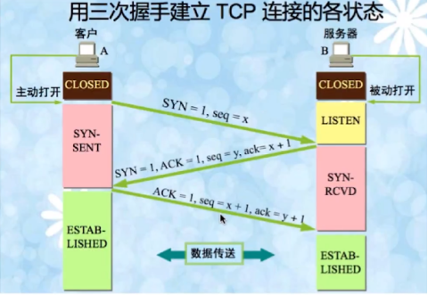

**第一次握手**：建立连接时，客户端发送SYN包到服务器，之后客户端进入**SYN_SEND**状态，等待服务端确认

**第二次握手**：服务端收到客户端发送的SYN包，必须确认客户端的SYN包，同时自己也向客户端发送SYN包，

​					   即服务端发送SYN+ACK包，发送之后服务端进入**SYN_RECV**状态

**第三次握手**：客户端收到服务器的SYN+ACK包之后，向服务端发送确认包，此包发送完毕后，客户端服务端都

​					   进入**ESTAB_LISHED**状态，此时客户端服务端可以进行传输数据，完成三次握手


### TCP握手存在的隐患

TCP在首次握手存在的隐患为：**SYN超时**

Server收到Client的SYN包之后，回复SYN-ACK之后确一直收不到Client的ACK确认，即没有完成三次握手

发生上述情况后，Server会不断重试，Linux默认重试5次等待63秒后断开TCP连接

这种情况可能造成**SYN-Flood攻击**，SYN-Flood攻击是一种典型的**Dos**（拒绝服务攻击），恶意程序持续向Server发送SYN包却不响应ACK，直到把SYN队列耗尽

**解决方案**：SYN队列被耗尽之后，通过tcp-syncookies参数发送SYN Cookie，若为正常连接的Client会发送SYN Cookie，建立连接


### TCP的四次挥手

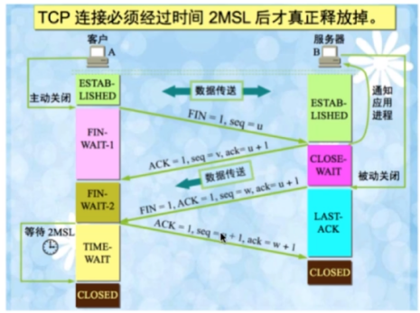

**第一次挥手**：Client向Server发送一个FIN包，关闭Client到Server的数据传输，发送后Client进入**FIN_WAIT_1**状					   态

**第二次挥手**：Server收到Client的FIN包，发送一个ACK确认给Clinet，Server进入**CLOSE_WAIT**状态

**第三次挥手**：Server向Client发送FIN包，关闭Server到Client的数据传输，发送后Server进入**LAST_ACK**状态

**第四次挥手**：Client收到FIN包后，Client进入**TIME_WAIT**状态，接着发送一个ACK给Server，Server收到ACK之后

​						直接进入**CLOSED**状态，Client需要等待**2MSL**之后进入CLOSED状态


### 为什么TCP需要四次挥手才能断开连接

因为TCP是**全双工**，发送方和接收方都需要发送FIN报文和ACK报文


### 为什么TCP四次挥手会有TIME_WAIT状态

1. 确保最后一个确认报文能够到达（如果server没收到client发送来的确认报文，那么就会重新发送连接释放请求报文，client等待一段时间就是为了处理这种情况的发生）

2. 避免新旧链接混淆（等待2MSL可以让本连接持续时间内所产生的所有报文都从网络中消失，使得下一个新的连接请求不会出现旧的连接请求报文）

   

### TCP和UDP的区别

1. TCP面向连接，UDP面向非连接
2. TCP具有可靠性
3. TCP具有有序性
4. UDP传输速度快
5. TCP重量级，TCP头20字节，UDP8字节


### TCP的滑动窗口(保证可靠性)

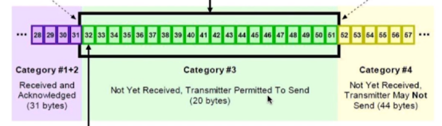

TCP 接收方缓存内有三种状态

- 已接收并且发送了ACK确认状态
- 未接收，但是可以接收状态（称为接收窗口）
- 未接收状态

TCP传输的可靠性来自**确认重传**，TCP滑动窗口的可靠性也来自确认重传

发送发之后收到接收方对于本段发送窗口内字节的ACK确认后才会移动发送窗口的左边界，接收窗口只有在前面所有段都确认的情况下才会移动左边界（当接收窗口中前面还有字节未接收，就收到了后面的字节，接收窗口的左边界是不会移动的，并不会对后面的字节进行确认，确保前面的数据会进行重传）


### TCP KeepAlive机制

Tcp KeepAlive和 Http Keep-Alive不能混为一谈,Tcp KeepAlive用来维持客户端和服务端的连接,一方定期发送心跳包给另一方,当有一方掉线时,没有返回ACK,而是RST,持续固定次数后,释放TCP连接,Tcp KeepAlive默认是关闭的

```bash
cat /proc/sys/net/ipv4/
sudo sysctl -a|grep keepalive
```

```
// 距离上次传送数据多少时间未收到新报文判断为开始检测，单位秒，默认7200s,2小时
tcp_keepalive_time 7200
// 检测开始每多少时间发送心跳包,单位秒,默认75s
tcp_keepalive_intvl 75
// 发送几次心跳包对方未响应则close连接,默认9次
tcp_keepalive_probes 9
```

开启了TCP keepAlive则TCP连接拥有一个保活计数器,正常的TCP连接会刷新保活计数器,当tcp_keepalive_time时间内无连接时,保活计时器超时,发送探测报文

Http Keep-Alive,客户端和服务端三次握手后,开启Keep-Alive可以复用同一个Tcp连接,提升效率


### 浏览器输入URL后，按下回车经历流程

1. DNS解析，由近道远依次是 **浏览器**缓存-->系统缓存-->**路由器**缓存-->**IPS服务器**缓存-->域名服务器缓存-->**顶级域名服务器**缓存
2. 进行TCP连接
3. 发送HTTP请求
4. 服务器处理请求返回HTTP报文
5. 浏览器解析结果渲染页面，结束连接


### 常见HTTP状态码

- 200： 正常
- 302： 重定向
- 400： Bad Request
- 401： 请求未经授权，这个状态码必须和WWW-Authenticate报头一起使用
- 403： 服务器正确收到请求，但是拒绝提供服务
- 404： 请求资源不存在
- 500： Server error
- 503： 服务器暂时无法处理请求，一段时间后可能恢复


### GET请求和POST请求的区别

- GET请求回退无害，POST会再次提交请求
- GET请求产生的URL可以被收藏夹收藏，POST不可以
- GET请求浏览器会主动缓存，POST不会，可以手动设置
- GET请求只能进行URL编码，POST支持多种编码方式
- GET请求请求参数会完整保留在浏览器历史中，POST请求不会保留参数
- GET请求URL参数长度有限制，POST没有
- GET于PSOT相比，不安全，GET将参数直接暴露在URL中，所以不能传递敏感信息，POST将参数存放在RequetBody中，相比GET安全一点
- GET请求，浏览器会把http header和data一并发送到Server，而POST，浏览器会先发送header，服务器响应状态码100 continue，浏览器在发送data， 并不是所有浏览器都会在POST中发送两次包，Firefox就只发送一次

其他请求
* HEAD:与GET本质一样,HEAD不含有数据,仅含有HTTP头信息,可以用于判断资源是否存在
* PUT:更新服务器资源,PUT通常指定了资源存放的位置
* DELETE:删除某一个资源
* OPTIONS:用于返回当前URL所支持的方法,在HTTP头中返回一个名为 Allow的头,值是所支持的方法,如GET,POST


### Cookie和Session的区别

- Cookie

  由服务器发送给客户端的特殊信息，以文本形式存放在客户端，客户端再次请求服务器时会把Cookie回发，服务器收到Cookie后，解析Cookie生成客户端对应的内容

- Session

  服务器机制，保存在服务器中的信息，解析客户端请求携带的sessionid，按需保存状态信息

  Session的实现方式：Cookie和URL回写（即将sessionid以参数的形式携带到URL中）

- 区别

  Cookie数据保存在客户端中，Session数据保存在服务器中

  Session相比Cookie更加安全

  Session数据保存在服务器中会增加服务器负担

gin session实现可以使用`github.com/gin-contrib/sessions`

### 1.12 HTTP和HTTPS区别

- https需要到CA认证申请证书，http不需要
- https密文传输，http明文传输
- https默认使用443端口，http默认使用80端口
- https=http+加密+认证+完整性保护，比http更加安全,https即http+ssl/tls
- https比http握手阶段比较耗时


### https建立连接步骤

1. 客户端发送https请求

2. 服务端向客户端发送证书公钥，CA证书就是一对公钥私钥，包含了证书的颁发机构过期时间等等

3. 客户端解析证书公钥，这部分工作由客户端的TLS完成的，首先验证证书公钥是否有效，如果存在问题，会弹出提示，说明证书存在问题

   如果证书公钥没问题，那么就生成一个随机值，然后用公钥对该随机值进行加密，这样除非有私钥否则看不到被锁的内容

4. 传输加密后的随机值

5. 服务端用私钥解密随机值之后，客户端和服务端都以这个随机值进行加密解密了


### http2.0和http1.1的差距

http1.0 

1. 默认使用短连接,每次请求都需要建立TCP连接,它可以通过设置Connection:keep-alive强制开启

2. 请求是串行的

3. 不支持断点续传

http1.1

1. 使用长连接,即TCP默认不关闭,一个TCP连接可以被多个HTTP复用

2. 分块传输,即服务端每产生一块数据,就发送一块,用流模式取代缓存模式

3. 管道机制,即在同一个TCP连接,客户端可以同时发送多个请求

4. 新增range字段,用来指定数据字节的位置,支持了断点续传

http2.0

1. 二进制协议,1.1版本头信息是文本(ASCII编码),数据体可是是文本或者二进制,2.0中头信息和数据体都是二进制,如果发送的多个请求的头部是相同的,http2.0会消除相同的部分(通过在客户端和服务端都维护一张索引表实现)

2. 多路复用,在同一个连接中,服务端和浏览器都可以同时发送多个请求或者回应,无需按照顺序,同一个连接里面连续的数据包可能属于不同请求的回应(对数据包做了标记,标记其属于哪一个请求,规定客户端的数据流编号为奇数,服务端数据流编号为偶数)

3. 报头压缩,http协议无状态,每次请求都必须附上所有信息,http2.0引入了头信息压缩机制,使用gzip或者compress压缩后发送

4. 允许服务端未经请求,主动向客户端发送资源

### Socket通信流程

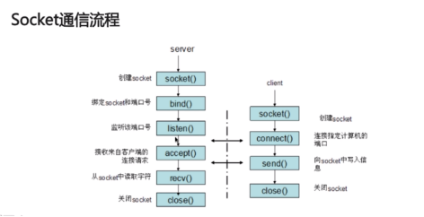


## 数据库

### 如何设计一个关系型数据库

一个关系型数据库主要包括以下几个模块

存储系统（文件系统），存储管理（逻辑地址映射成物理地址），缓存模块，SQL解析模块，日志管理模块，权限划分模块，灾容模块，索引模块，锁模块

### 数据库3范式

1. 1NF：列不可再分，一列数据之恶能存储一个数据，不能再次拆分，强调原子性
2. 2NF：不可把多种数据保存在同一张表中，即一张表只能描述一种数据，强调唯一性
3. 3NF：消除字段冗余


### 索引的作用

在**数据量大**的情况下，可以**加快查询**效率，尽量避免全表扫描


### 什么样的信息可以成为索引

主键，唯一键，普通键


### 索引的数据结构

二叉树，B树，B+树，Hash，BitMap

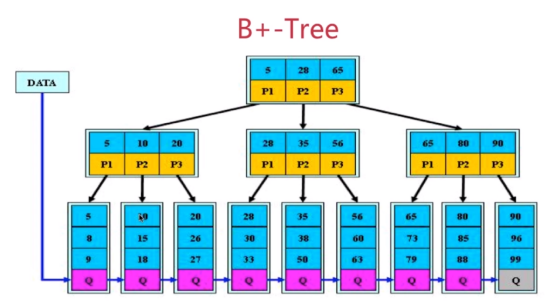

B+树特点：

- 非叶子节点的子树指针个数与关键字个数相同
- 非叶子节点仅仅进行索引，所有数据必须在叶子节点中才能获取到
- 非叶子节点的子树指针p[i],指向关键字值[k[i] , k[i+1])
- 所有的叶子节点均有一个链指针指向下一个叶子节点

B+树的优点：

1. B树不管叶子节点还是非叶子节点，都会保存数据，这样导致在非叶子节点中能保存的指针数量变少，指针少的情况下要保存大量数据，只能增加树的高度，导致IO 操作变多，查询性能变低
B+树因为树的层高较低，所以B+树磁盘读写代价更低
2. B+树查询效率更加稳定,所有叶子节点查询效率时间复杂度为O(log n)
3. 有利于数据库扫描


### 密集索引和稀疏索引的区别

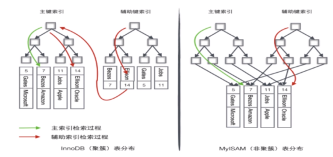

聚簇索引：其叶子节点保存不仅仅是键值，还保存了位于同一行记录里的其他列的信息，找到了索引也就找到了数				   据，B+树是一种聚簇索引

稀疏索引：只为索引码的某些值建立索引项，其叶子节点仅保存了键位信息以及该行数据的地址或者主键，查找时需要查到索引，对应到主键信息，然后根据找到的主键信息在B+Tree中再执行一遍B+Tree的索引操作，最终再到达叶子节点获取整行的数据（回表操作）

InnoDB有且只有一个聚簇索引，而MyISAM中都是非聚簇索引


### 为什么InnoDB只有一个聚簇索引，而不将所有索引都使用聚簇索引

因为聚簇索引决定了表的物理排列顺序，所以有且仅有一个

并且聚簇索引是将索引和数据都存放在叶子节点中，如果所有索引都是用聚簇索引，则每一个聚簇索引都将保存一份数据，造成数据冗余，消耗不必要的资源


### 索引越多越好吗

数据量小的表不需要建立索引，建立索引会增加额外的开销

索引只能加快查询效率，如果数据产生增删，则需要重新维护索引，增加维护成本

更多的索引需要更多的空间


### MyISAM和InnoDB锁区别

MyISAM 默认表锁，不支持行锁

InnoDB默认行锁，支持表锁


MyISAM 在读取数据时会给整张表加上一个读锁，读取未完成时，其他Session进行增删时会给表加写锁，因为读锁未释放，所以写锁必须等待

显式加锁： lock table xxx read | write

释放锁： unlock tables 


**读锁**也叫**共享锁**（lock in share mode）,**写锁**也叫**排他锁**（for update)

先上读锁，可以在上读锁，不能上写锁

先上写锁，不可以在家任何锁


InnoDB 不走索引时使用的时表锁，走索引使用行锁


### MyISAM 和 InnoDB 适用场景

MyISAM ：

- 频繁执行全表count语句（不带where条件），MyISAM 存储引擎中，把表的总行数存储在磁盘上
- 查询频繁，增删频率高
- 无需事务

InnoDB：

- 数据增删改查都频率较高
- 可靠性要求较高，需要支持事务


### 事务四大特性（ACID）

- 原子性 (Atomic)
- 一致性 (Consistency)
- 隔离性 (Isolation)
- 持久性 (Durability)


### 事务并发引起的问题

1. 丢失更新

   一个事务更新覆盖另一个事务更新

   eg：两个事务同时访问同一账户，session1查询余额为100，session2查询余额也为100，存入20余额变为120后session2提交事务，此时session1取出10，但是回滚事务，余额变为100，session2丢失更新

2. 脏读

   一个事务读取到另一个事务未提交的数据

   eg：两个事务同时访问同一账户，session1查询余额为100，取出10后，查询余额为90，此时session1并未提交事务，session2进行查询，查询余额为90，此时session1回滚事务，余额回滚为100，但是session2并不知道，还以为余额为90

3. 不可重复读

   事务多次读取同一数据，结果不一样

   eg：session1第一次读取【id=1，name=xx】，session2修改id=1的数据name=ss，并且提交事务，session1再次读取id=1的数据发现和第一次读取不一致

4. 幻读

   事务a读取与搜索条件匹配的行有3行，事务b插入或者修改该事务a的结果集，事务a更新所有与搜索条件匹配的数据，发现却不是3行

|        事务隔离级别        | 丢失更新 | 脏读 | 不可重复读 | 幻读 |
| :------------------------: | :------: | :--: | :--------: | :--: |
| 未提交读 (read uncommited) |    ×     |  √   |     √      |  √   |
|  已提交读 (read commited)  |    ×     |  ×   |     √      |  √   |
|  可重复读 (repeated read)  |    ×     |  ×   |     ×      |  √   |
| 串  行  化 (serializable)  |    ×     |  ×   |     ×      |  ×   |

实际上MySQL的可重复读也可以避免幻读


### 索引失效条件

- 在索引列上做任何操作（计算，函数，类型转换），导致索引失效
- 在组合索引中，如果中间莫格字段适用了范围条件，右边的索引列失效
- mysql在适用不等于（!= 或者<>），会使索引列失效
- is null 和 is not null 无法适用索引
- like通配符放在索引列左边，索引失效
- or，会使索引失效，可以用union代替

### MySQL主从复制原理是什么

主库将变更写入binlog日志，从库连接到主库，有一个线程将主库的binlog日志拷贝到自己本地，写入一个relay中继日志种，接着从库就会启用一个SQL线程从中继日志读取binlog，执行binlog种的内容

### MySQL主从同延时问题怎么解决

通过MySQL命令show status 查看Seconds_Behind_Master，可以卡拿到从库复制主库数据落后多少

半同步复制：解决主库图软宕机，数据没有同步到从库上，数据丢失问题
所谓半同步复制，指主库写入binlog日志后，会强制立即将数据同步到从库，从库将日志写入relay log之后，会返回一个ack给主库，主库接收到至少一个从库的ack才认为写操作完成

并行复制：解决时延问题
指的是从库开启多个线程并行读取relay log种不同库的日志，并行回放不同库的日志

分库：一个主库拆分为多个主库，每个主库的并发就减少了几倍
打开并行复制，多个库并行复制


## 基础知识

### 死锁产生的条件,如何避免

4个必要条件
1. 互斥条件:一个资源一次只能被一个进程使用
2. 占有且等待:一个进程因请求资源而阻塞时,对已经获得的资源保持占有
3. 不可强行占有:进程已经获得的资源,不能被强行剥夺
4. 循环等待条件:若干进程形成循环等待资源关系

eg: 有张三和李四两人,A和B两个资源,张三持有A请求B,李四持有B请求A


### 负载均衡

常见的负载均衡算法:
1.	轮询法
2.	随机法
3.	源地址hash法，客户端ip通过hash函数得到一个数值,用该值对服务器数量取模运算,当后端服务器数量不变时,每次会映射到同一台服务器
4.	加权轮询法
5.	加权随机法
6.	最小连接数法，用积压请求最少的一台服务器来处理当前请求,可以尽可能的提高后端服务的利用率

### Nginx五种负载均衡

1. 轮询(默认)
2. weight
3. ip_hash
4. fair(第三方)响应时间短优先分配
5. url_hash(第三方)按url的hash分配请求

```bash
# 权重
upstream backend {
    server backend1.example.com weight=3;
    server backend2.example.com weight=2;
}

# ip_hash
upstream backend {
    ip_hash;
    server backend1.example.com;
    server backend2.example.com;
}

# fair
upstream backend {
    server backend1.example.com;
    server backend2.example.com;
    fair;
}

# url_hash
upstream backend {
    server backend1.example.com;
    server backend2.example.com;
    hash $request_uri;
    hash_method crc32;
}
```

### 什么是分布式系统

在<<分布式系统概念与设计>>中的定义:

分布式系统是由一个 硬件或者软件组件分布在不同网络计算机上,彼此之间通过消息传递进行通信和协调的系统

分布式与集群:

分布式:指部署在多台服务器中的不同的服务,通过协同工作,对外提供服务

集群:指部署在多台服务器中相同的应用或者服务,通过负载均衡对外提供服务

### Web安全名词

Dos  denial of service 拒绝服务攻击

DDos distributed denial of service 分布式拒绝服务攻击

DRDos distributed reflection denial of service 分布式反射拒绝服务攻击

Xss  cross-site scripting跨站脚本攻击

CSRF  cross-site request forgery跨站请求伪造


## 缓存

### 缓存击穿,缓存雪崩,缓存穿透

* 击穿:热点key失效,造成访问该key的请求直接访问数据库,造成数据库瘫痪

* 雪崩:缓存层挂掉,所有请求直达数据库,造成数据库瘫痪

* 穿透:访问缓存中不存在的key,请求直接查询数据库,大量请求导致数据库瘫痪

Redis下解决方案:

1. 集群,哨兵,解决雪崩

2. 不同key,设置不同的过期时间,尽量平均分布,防止大量key同时失效

3. 热点key,永不过期(快过期时后台刷新缓存)

4. 缓存失效后,通过加锁控制访问数据库线程数量,如:对某个key只允许一个线程进行访问


### 一致性Hash

使用一致哈希算法后,哈希表槽位数(大小)的改变平均只需要对 K/n 个关键字重新映射，其中K是关键字的数量,n是槽位数量.然而在传统的哈希表中，添加或删除一个槽位的几乎需要对所有关键字进行重新映射

一致性hash是将整个hash值的空间组织成一个虚拟的圆环,空间为[0,2^32-1]即无符号整形

把服务器按照IP或主机名作为关键字进行哈希,这样就能确定其在哈希环的位置

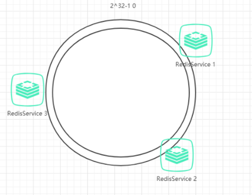

然后,我们就可以使用哈希函数计算值为key的数据在哈希环的具体位置h，根据h确定在环中的具体位置，从此位置沿顺时针滚动，遇到的第一台服务器就是其应该定位到的服务器
例如我们有A,B,C,D四个数据对象,经过哈希计算后,在环空间上的位置如下：
数据A会被定为到Server 1上,数据B被定为到Server 2上,而C,D被定为到Server 3上

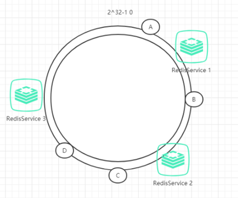

容错性

假如RedisService2宕机,那么B对应的数据会从RedisService2转移到RedisService3上,受干扰的只有RedisService2上保存的数据

扩展性

假如RedisService2和RedisService3之间新增了RedisSerivce4,RedisService4正好落在C,D对象之间,那么C对象会由RedisSerivce3对象转移到RedisService4上,受干扰的只有RedisService3上保存的数据

一致性Hash虚拟节点

为了解决多台服务器可能在Hash环中分布不均匀,造成数据存储分布不均匀,可以将每个节点计算多个hash值映射在Hash环中


### 分布式缓存框架singleflight

在分布式缓存和高并发场景中,singleflight是一个极具价值的并发控制机制。它的核心目标非常明确:对多个并发的、相同的请求进行合并,确保在同一时刻,针对同一资源的实际操作只执行一次。这能有效防止缓存系统失效时,大量重复请求“击穿”缓存而压垮后端数据库,也就是我们常说的 “缓存击穿”​ 

#### 典型应用场景​ 

1. 防止缓存击穿:这是最经典的应用场景,正如上文多次提到的。

2. 接口限流与降级:在面对瞬时高并发请求某个外部API时,可以使用 singleflight 合并请求,减轻对API的压力。

3. 分布式系统:在多个节点可能同时触发相同操作（如配置更新）时,可以在节点内部使用 singleflight 避免重复工作。

#### 重要注意事项​ 

1. 错误传播:如果首次请求的回调函数 fn返回了错误,那么这个错误会被共享给所有等待该结果的请求。你需要确保错误处理逻辑能够应对这种情况。

2. 潜在阻塞风险:如果某个回调函数 fn执行时间非常长,或者因为某些原因（如死锁）一直不返回,那么所有在等待这个 key 的请求都会被永久阻塞。对于可能长时间运行的操作,考虑使用 DoChan并结合超时控制,或者使用 Forget方法。

3. 内存开销:虽然 singleflight 减少了重复的计算和IO,但它需要在内存中维护一个 call的映射。在超高并发且key离散度很大的场景下,需要注意映射的大小。不过,由于每个 call在请求结束后会立即被删除,这个映射通常不会无限增长。

4. 非缓存替代品:Singleflight 是一种并发控制机制,而不是一个缓存。它合并的是同一时刻的并发请求。对于不同时刻的请求 (如一秒后再次请求相同key),如果缓存依然失效,它仍然会触发新的数据加载操作。因此,它需要与一个独立的缓存（如Redis、本地Map）配合使用。

## 分布式相关

### 为什么使用消息队列，消息队列有什么优缺点

#### 核心作用（优点）

* 解耦：A通过接口向BCD三个系统发送数据，如果E也需要呢，C不需要呢，导致A与其他系统耦合度过高，如果适用MQ，A产生一条消息后发送到MQ，哪个系统需要直接去MQ消费。

* 异步：A收到请求在本地写库，还需要再BCD三个系统写库，三个系统依次写库耗时太长，如果适用MQ，A系统本地写库后连续发送3条消息到MQ，直接返回响应给用户，用户体验极好。

* 削峰：高并发每秒有5k+请求，mysql每秒最多扛2k左右请求，同时涌入大量请求会导致mysql系统崩溃，如果使用MQ，每秒5k请求写入MQ，A系统从MQ拉去请求，每秒拉取2K个，保证系统不会崩溃。


#### 缺点

* 系统可用性降低：外部依赖越多系统越容易挂掉

* 系统复杂性提高：需要考虑消息有没有重复消费，消息丢失，消息传递顺序等问题

* 一致性问题：A处理完请求返回成功，但是BCD三个系统中不能保证都执行成功

### Kafka、ActiveMQ、RabbitMQ、RocketMQ有什么区别以及适用那些场景

| 特性                   | Kafka      | ActiveMQ   | RabbitMQ   | RocketMQ   |
|------------------------|------------|------------|------------|------------|
| 单机吞吐量             | 10万级     | 万级       | 万级       | 10万级     |
| Topic数量对吞吐量影响  | Topic到几十到几百时吞吐量大幅度下降 |            | Topic可以达到几百到几千级别，吞吐量小幅度下降 |            |
| 失效性                 | ms级       | ms级       | 微秒级     | ms级       |
| 可用性                 | 非常高，分布式 | 高，主从架构的高可用 | 高，主从架构的高可用 | 非常高，分布式 |
| 消息可靠性             | 经过优化配置，0丢失 | 有较低概率丢失 | 基本不丢   | 经过优化配置，0丢失 |

### 消息队列如何保证高可用性

RabbitMQ，是基于主从（非分布式）做高可用性

RabbitMQ有三种模式，单机模式、普通集群模式、镜像集群模式

普通集群模式：在多台机器上启动多个RabbitMQ 实例，每个机器启动一个。你创建的 queue，只会放在一个 RabbitMQ 实例上，但是每个实例都同步 queue 的元数据（元数据可以认为是 queue 的一些配置信息，通过元数据，可以找到 queue 所在实例）。你消费的时候，实际上如果连接到了另外一个实例，那么那个实例会从 queue 所在实例上拉取数据过来。

镜像集群模式（高可用性）
在镜像集群模式下，创建的 queue，无论元数据还是 queue 里的消息都会存在于多个实例上，就是说，每个 RabbitMQ 节点都有这个 queue的一个完整镜像，包含 queue 的全部数据。然后每次你写消息到 queue 的时候，都会自动把消息同步到多个实例的 queue 上。

### 如何保证消息不被重复消费，即如何保证消费的幂等性


结合业务来：
如让生产者发送数据时候，里面加一个全局唯一id，类似订单id，消费到了之后，先根据id去redis查一下是否消费过，没消费过就处理，然后id写入reids，如果消费过则跳过；
再如通过数据库唯一键来保证数据不会重复插入多条

### 如何保证消息可靠性传输（如何处理消息丢失）

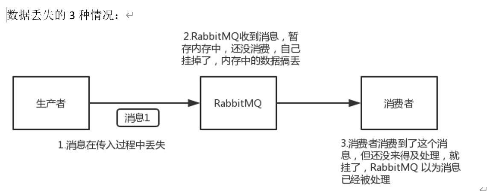

#### 生产者丢失

方案1：开启RabbitMQ事务机制，不建议使用，太消耗性能

方案2：开启生产者confirm机制，消息写入RabbitMQ，如果成功接收会返回一个ack消息，如果没能处理，会返回一个nack，可以进行重发

#### RabbitMQ丢失

开启RabbitMQ持久化，保证Queue和发送的消息都设置为持久化

#### 消费者丢失

关闭RabbitMQ的自动ack确认


### Zookeeper的应用场景

1.	分布式协调，可以基于其临时节点的特性，不同机器在 ZooKeeper 的一个指定节点下创建临时子节点，不同机器之间可以根据这个临时节点来判断客户端机器是否存活。

2.	分布式锁

3.	配置信息管理（注册中心）zookeeper 可以用作很多系统的配置信息的管理，比如 kafka、storm 等等很多分布式系统都会选用 zookeeper 来做一些元数据、配置信息的管理，包括 dubbo 注册中心

### Redis分布式锁和zk分布式锁的对比

redis 分布式锁，其实需要自己不断去尝试获取锁，比较消耗性能。

zk 分布式锁，获取不到锁，注册个监听器，不需要不断主动尝试获取锁，性能开销较小。

如果是 redis 获取锁的那个客户端 挂了，只能等待超时时间之后才能释放锁；而 zk 的话，因为创建的是临时 znode，只要客户端挂了，znode 就没了，此时就自动释放锁

### 分布式ID生成方式

1. UUID 性能差

2. 数据库自增ID 需要一个单独的MYSQL来提供服务，无法抗住高并发

3. 基于数据库的号段模式，从数据库批量的获取自增ID，每次从数据库取出一个号段范围，例如 (1,1000] 代表1000个ID

4. 基于redis实现，利用redis的incr命令

5. 基于雪花算法snowflake模式

### 如何设计一个高并发系统 

* 系统拆分，将一个系统拆分为多个子系统，每一个系统连接一个数据库

* 缓存，大部分的高并发场景，都是读多写少，可以在数据库和缓存里都写一份，读的时候大量走缓存， redis 轻轻松松单机几万的并发。

* MQ，MySQL扛不住高并发，用MQ大量的写请求灌入 MQ 里，排队慢慢玩儿，后边系统消费后慢慢写，控制在 mysql 承载范围之内。

* 分库分表，将一个数据库拆分为多个库，多个库来扛更高的并发；然后将一个表拆分为多个表，每个表的数据量保持少一点，提高 sql 跑的性能。

* 读写分离，大部分时候数据库是读多写少，没必要所有请求都集中在一个库上，可以搞主从架构，主库写入，从库读取，读写分离。读流量太多的时候，还可以加更多的从库。

* Es是分布式的，可以随便扩容，一些比较简单的查询、统计类的操作，可以考虑用 es 来承载，还有一些全文搜索类的操作，也可以考虑用 es 来承载。

### 分库分表

分库：一个库，并发最多2000，分库是将一个库种的数据拆分到多个库中，减轻并发压力

分表：单表数据太多严重影响SQL执行性能，需要将一个表的数据放在多个表中，单表控制在200w以内

### 有一个未分库分表的系统，未来要分库分表，如何才能从未分库分表动态切换到分库分表上

双写迁移方案：比较靠谱，不用停机，就是同时写老库和新库，系统部署后，写一个导数工具，跑起来读老库写新库，写的时候判断数据最后修改时间，若这条数据在新库中不存在，或者这条数据比新库中的数据新才可以写，不允许老数据覆盖新数据，当数据完全一致后，重新部署代码

## Golang

### Go channel close后读问题

给close channel发送数据,引起panic

从close channel 接收数据,如果缓冲区不为空,则接收到缓冲区数据,

如果缓冲区为空,则接收到零值

### Go slice和array的区别,Slice扩容

slice是基于array实现的,slice并不是动态数组或者数组指针,内部是通过指针引用一个底层数组,并且将数据读写限制在一定区域内

slice扩容策略

首先判断,若申请容量大于旧容量的两倍,新容量即为申请容量

否则判断,若旧切片长度小于1024,则新容量为旧容量的两倍

否则判断,若旧切片长度大于1024,则新容量从旧容量循环增加原来的1/4,直到最终容量大于申请容量

如果最容容量计算值溢出,则最终容量就是新申请容量

### GMP模型

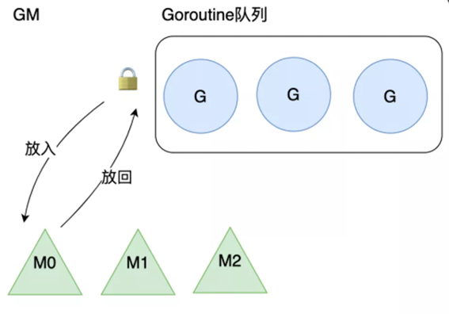

golang 1.1使用GM模型

M从加锁的全局队列获取G,缺点将G放入或者取出都需要获取锁,竞争激烈

M转移G没有把资源最大化利用,比如当M1在执行G1时,M1创建了G2,为了继续执行G1,

需要把G2交给M2执行,因为G1和G2是相关的,而寄存器中会保存G1的信息,因此G2最好放在M1上执行,而不是其他的M


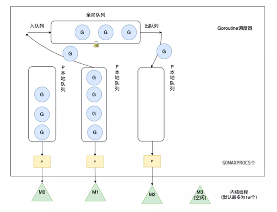

全局队列:当P中的G溢出时会放在全局队列中

P的本地队列:P内置的G队列,容量不超过256

当P1中运行的G1在运行过程中新建G2时,G2优先放在P1的本地队列,如果P1以满,则将P1本地队列中一半的G放入全局队列

P如果为空,则优先区全局队列中获取G,若全局队列也为空,则从其他P中偷取一半的G

P的数量由环境变量GOMAXPROCS或者是runtime.GOMAXPROCS()决定

M默认为10000个,可以通过runtime/debug中SetMaxThreads()改变

G在GMP模型中的流动过程

1. 调用 go func()创建一个goroutine
2. 新创建的G优先保存在P的本地队列中,如果P的本地队列已经满了就会保存在全局的队列中
3.  M需要在P的本地队列弹出一个可执行的G,如果P的本地队列为空,则先会去全局队列中获取G,如果全局队列也为空则去其他P中偷取G放到自己的P中
4.  G将相关参数传输给M,为M执行G做准备
5. 当M执行某一个G时候如果发生了系统调用产生导致M会阻塞,如果当前P队列中有一些G,runtime会将线程M和P分离,然后再获取空闲的线程或创建一个新的内核级的线程来服务于这个P,阻塞调用完成后G被销毁将值返回
6. 销毁G,将执行结果返回
7. 当M系统调用结束时候,这个M会尝试获取一个空闲的P执行,如果获取不到P,那么这个线程M变成休眠状态,加入到空闲线程中

GMP相较于GM有三个优化点
1. 每个P都有自己的本地队列,获取G优先从自己本地队列获取,不需要加锁,而从全局队列中获取会产生锁竞争
2. GMP实现了Work Stealing算法,如果P的本地队列为空,则会去全局队列或者其他P中窃取G,提高资源利用率
3. hand off机制,如果M在执行G中产生系统调用而阻塞,线程会释放P,把P交给其他M执行,提高资源利用率

### go struct能不能比较

不同结构体无法比较

相同结构体不包含无法比较的类型 (slice,map) 则可以比较

### go defer (for defer)

defer 传入的函数不是在退出代码块的作用域时执行的,它只会在当前函数和方法返回之前被调用

假设我们想要计算 main 函数运行的时间
```golang
func main() {
	startedAt := time.Now()
	defer fmt.Println(time.Since(startedAt))
	time.Sleep(time.Second)
}
$ go run main.go
0s
```
调用 defer关键字会立刻拷贝函数中引用的外部参数,所以 time.Since(startedAt) 的结果不是在 main 函数退出之前计算的,

而是在 defer 关键字调用时计算的,最终导致上述代码输出 0s

```golang
func main() {
	startedAt := time.Now()
	defer func() { fmt.Println(time.Since(startedAt)) }()
	time.Sleep(time.Second)
}
$ go run main.go
1s
```

调用 defer 关键字时也使用值传递,但是因为拷贝的是函数指针,

所以 time.Since(startedAt) 会在 main 函数返回前调用并打印出符合预期的结果

### select可以用于什么

select和switch一样有多个case,但是每一个case都只能用于chan的收发工作

select遇到多个chan同时响应时,会随机执行一种情况

select 若不存在default选项,则

select会阻塞当前Goroutine并等待多个chan中的一个达到可以收发的状态

select 若存在defaulte选项,则为非阻塞收发

存在以下两种情况:
1. 当存在可以收发的chan时,直接处理该chan对应的case
2. 当不存在可以收发的chan时,执行 default 中的语句

### context包的用途

context主要用于设置截止日期,同步信号,传递请求相关值的结构体

context.Context主要包含4个方法

```golang
type Context interface {
    //返回被取消的时间
	Deadline() (deadline time.Time, ok bool)
	Done() <-chan struct{}
    //如果context.Context被取消返回Canceled错误
    //如果context.Context超时返回DeadlineExceeded错误
	Err() error
    //从context.Context中获取键值,对于同一个上下文
    //多次调用同一key,返回的结果总是一样
	Value(key interface{}) interface{}
}
```

### 主协程如何等其余协程完再操作

sync.WaitGroup

```golang
func main() {
	wg := sync.WaitGroup{}
	wg.Add(10)
	for i := 0; i < 10; i++ {
		go do(&wg)
	}
	wg.Wait()
	fmt.Println("main exec")
}

func do(wg *sync.WaitGroup) {
	defer wg.Done()
	fmt.Println("do exec")
}
```

### map如何顺序读取

对Key排序

### init函数的执行顺序

在main函数之前执行，init()函数是go初始化的一部分，由runtime初始化每个导入的包，初始化不是按照从上到下的导入顺序，而是按照解析的依赖关系，没有依赖的包最先初始化。

执行顺序：import –> const –> var –>init()–>main()

一个包中可以包含多个init()函数，并且执行顺序不做保证

### Go垃圾回收机制

* Go1.3采用标记清除法
* Go1.5采用三色标记法
* Go1.8采用三色标记法+混合写屏障

#### 标记清除法

普通标记清除法，整体过程需要启动STW，效率极低

1. 暂停程序业务逻辑, 找出不可达的对象，然后做上标记。
2. 回收标记好的对象。

#### 三色标记法

假设 root（栈、全局变量等）指向一些对象，

1. 初始时所有对象为标记为白色
2. root引用的对象标记为灰色
3. 循环扫描灰色对象，将自身变为黑色，将引用的白色对象标记为灰色，直到没有灰色对象为止
4. 清理白色对象

#### 三色标记+混合写屏障

在三色标记的基础上，增加了写屏障（Write Barrier）机制。